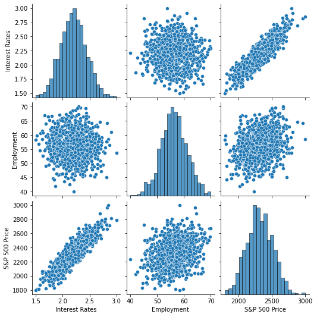
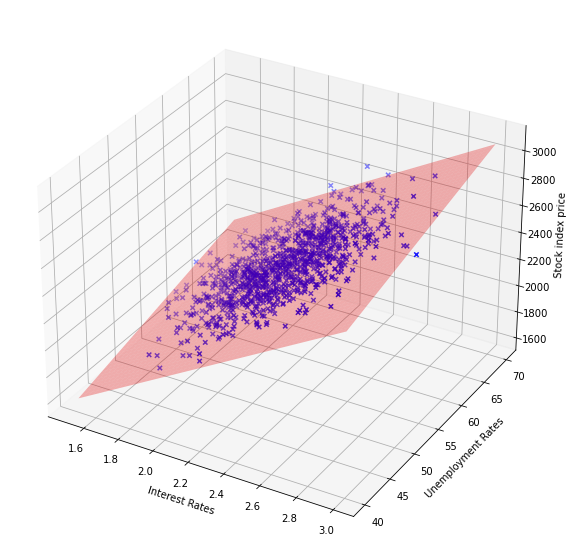
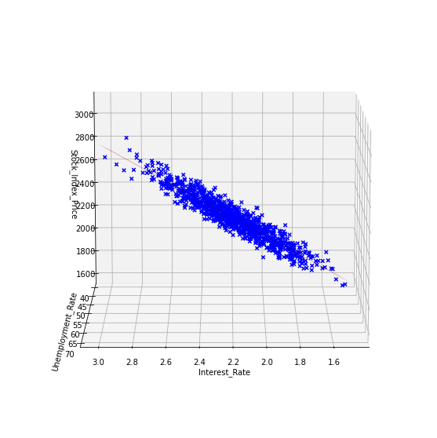

# S&P 500 Index Predictor

The objective of this kernel is to create a Regression model which predicts the value of the S&P 500 index based on the employment rate and the interest rate.
 
Our Regression Analysis kernel consists of 7 steps:

### Step 0 (dubbed Step 0 in our house because it is a preparatory step) - Import the Libraries:
in addition to the scikit-learn library whhich we use to perform the Regression analysis, we also use several other packages and modules:

- **Pandas**:used for data structures and operations for manipulating numerical tables
- **Numpy**: used for numerical analysis
- **matplotlib.pyplot**: used for plotting data
- **seaborn**: used for data visualization (used on top of matplotlib library)
- **sklearn**: used in our kernel to split the set into a training and a testing set, to create the model, and to evaluate the model.
- **mpl_toolkits.mplot3d**: used to create the 3D visualization of the results.

### Step 1 - Import the Dataset:
We import the data from a csv file, and we load it into a pandas DataFrame object.

### Step 2 - Visualize Data:
We explore the dataset using a pairplot and jointplots.

### Step 3 - Create Training and Testing Set: 
We split our data set into a training and testing sets. We use 30% for testing the classifier:

- **X_train**: Contains the independent variables used for training
- **y_train**: Contains the dependent variables used for training
- **X_test**:	Contains the independent variables used for testing
- **y_test**:	Contains Dependent variables used for testing

### Step 4 - Train Model:
We create a linear regression model and we fit it to our training data.

### Step 5 - Evaluate Model:
We plot our predictions againt the ground truth, then we calculate the following metrics:

- RMSE =  63.54 
- MSE = 4037.317672818159 
- MAE = 52.09974808996405 
- R2 = 0.89003456905339 
- Adjusted R2 = 0.8892940611008875 
- MAPE = 2.241228465749491

### Step 6 - Visualize Results:
We use the Axes3D module from mpl_toolkits to create a 3D visualization of the results with a plane which represents our model

We can visualize this graph from several angles to explore the results.

